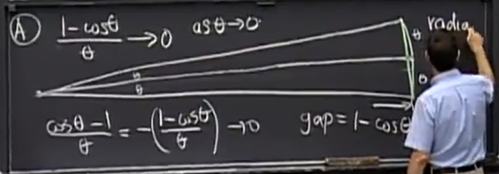
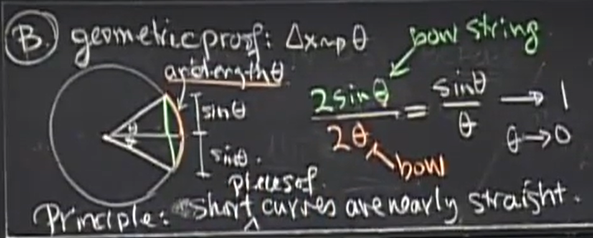

## 极限与连续

左极限：$ \lim\limits_{ x \to x_0^-} f(x) $

右极限：$ \lim\limits_{ x \to x_0^+} f(x) $

（双侧）极限：$ \lim\limits_{ x \to x_0} f(x) $

> 比较反直觉的是，从表达式来看，某点处有极限并不要求函数在该点处有定义，换言之二者是不相关的

连续：$ \lim\limits_{ x \to x_0^-} f(x) = \lim\limits_{ x \to x_0^+} f(x) = \lim\limits_{ x \to x_0} f(x) = f(x_0) \iff \lim\limits_{x \to x_0} [f(x) - f(x_0)] = 0$

> 函数在某点连续要求函数在该点函数值等于（双侧）极限值，这隐含了两个前提：
> 1. 该点处的（双侧）极限应该是存在的
> 2. 该点处函数值应该是存在的

某点处极限不存在（即该点为间断点）的情况：

- 该点处的极限值存在（第一类间断点）
  - 可去间断点：$ \lim\limits_{ x \to x_0} f(x) = A $ 但 $ f(x_0) $ 不存在或 $ f(x_0) \ne A $
  - 跳跃间断点：$ \lim\limits_{ x \to x_0^-} f(x) = A $ 且 $ \lim\limits_{ x \to x_0^+} f(x) = B $ 但 $ A \ne B $
- 该点处的极限值不存在（第二类间断点）
  - 无穷间断点：$ \lim\limits_{ x \to x_0^-} f(x) = \pm \infty $ 或 $ \lim\limits_{ x \to x_0^+} f(x) = \pm \infty $
  - 震荡间断点：$ \lim\limits_{ x \to x_0} f(x) $ 不存在但也不是 $ \pm \infty $，只是在该点处不停震荡，例：$ \lim\limits_{x \to 0} \sin{\frac{1}{x}} $

两个重要极限：

$$
\begin{align*}
    & \lim\limits_{x \to 0} \frac{\sin x}{x} = 1 \\
    & \lim\limits_{x \to 0} \frac{1 - \cos x}{x} = 0
\end{align*}
$$

> 这两个极限需要用几何证明，当 $ \theta \to 0 $，曲线等同于直线，图示为 MIT-18.01 中对 $ \lim\limits_{x \to 0} \frac{\sin x}{x} = 1 $ 的几何证明
> 
> 

## 一阶导数

几何意义：割线斜率的极限/一点的切线

物理意义：物理量在某点的瞬时变化率

记号：$ f'(x) = \frac{\mathrm{d}f}{\mathrm{d}x} = \frac{\mathrm{d}}{\mathrm{d}x}f = \frac{\mathrm{d}y}{\mathrm{d}x} = \frac{\mathrm{d}}{\mathrm{d}x}y = Df = Dy$

表达式:

$$
\begin{align*}
    & f'(x) = \frac{ \Delta f}{\Delta x} = \lim\limits_{ \Delta x \to 0} \frac{ f(x + \Delta x) - f(x)}{\Delta x} \\
    & f'(x_0) = \frac{ \Delta f}{\Delta x} = \lim\limits_{ x \to x_0 } \frac{ f(x) - f(x_0) }{ x - x_0 } 
\end{align*}
$$

定理：函数在某点处可导，则函数在该点处必然连续（推广可知，处处可导的函数，处处连续）
证明：

$$
\begin{align*}
    \lim\limits_{x \to x_0} [f(x) - f(x_0)]
    & = \lim\limits_{x \to x_0} \frac{f(x) - f(x_0)}{x - x_0}(x - x_0) \\
    & = f'(x_0) \lim\limits_{x \to x_0} (x - x_0) \\
    & = f'(x_0) \times 0 \\
    & = 0
\end{align*}
$$

用表达式可以推出以下常见函数的导数：

$$
\begin{align*}
    & (x^r)' = rx^{r-1} \\
    & (\sin x)' = \cos x \\
    & (\cos x)' = - \sin x \\
    & (\tan x)' = \sec^2 x \\
    & (\sec x)' = \sec x \tan x \\
    & (e^x)' = e^x \\
    & (\ln x)' = \frac{1}{x} \\
    & (\arctan x)' = \frac{1}{1 + x^2} \\
    & (\arcsin x)' = \frac{1}{\sqrt{1 - x^2}}
\end{align*}
$$

> 三角函数的导数推导过程中需要用到三角形和差角公式
> 
> $$
> \begin{align*}
>    & \sin(\alpha \pm \beta) = \sin\alpha \cos\beta \pm \cos\alpha \sin\beta \\
>    & \cos(\alpha \pm \beta) = \cos\alpha \cos\beta \mp \sin\alpha \sin\beta
> \end{align*}
> $$

导数四则运算公式：

$$
\begin{align*}
    & [f(x) \pm g(x)]' = f'(x) \pm g'(x) \\
    & [f(x)g(x)]' = f'(x)g(x) + f(x)g'(x) \\
    & [\frac{f(x)}{g(x)}]' = \frac{f'(x)g(x) - f(x)g'(x)}{g^2(x)}
\end{align*}
$$

求导链式法则：$ [f(g(x))]' = f'(g(x))g'(x) $

> 链式法则的原理是这样：$ \frac{\mathrm{d}f}{\mathrm{d}x} = \frac{\mathrm{d}f}{\mathrm{d}t} \frac{\mathrm{d}t}{\mathrm{d}x} $，其中 $ t = g(x) $

根据常见函数的导数、导数四则运算公式和求导链式法则，可以求出绝大部分函数的导数

## 高阶导数

即导数的导数

记号：$ f''(x) = \frac{\mathrm{d}\frac{\mathrm{d}f}{\mathrm{d}x}}{\mathrm{d}x} = \frac{\mathrm{d}}{\mathrm{d}x}\frac{\mathrm{d}f}{\mathrm{d}x} = \frac{\mathrm{d}}{\mathrm{d}x}\frac{\mathrm{d}}{\mathrm{d}x}f = (\frac{\mathrm{d}}{\mathrm{d}x})^2f = \frac{\mathrm{d}^2}{(\mathrm{d}x)^2}f = \frac{\mathrm{d}^2f}{\mathrm{d}x^2} = D^2f$

