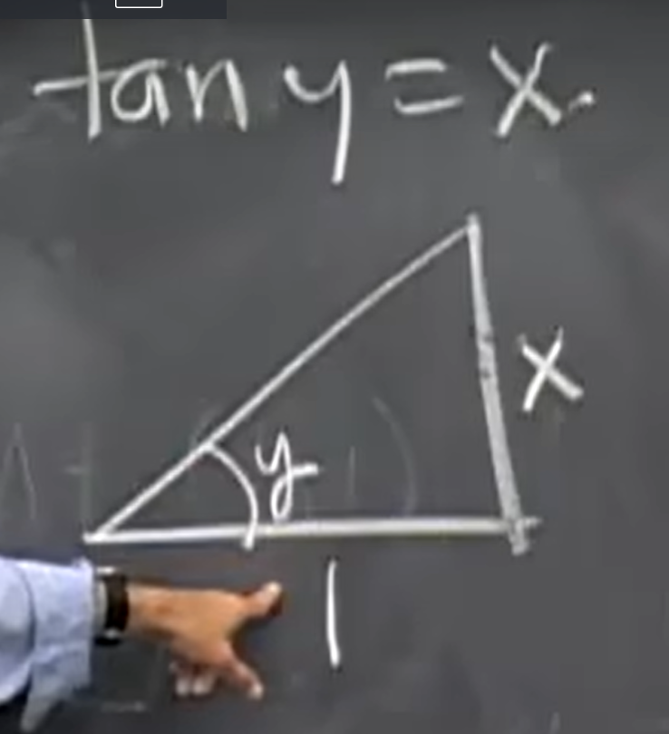
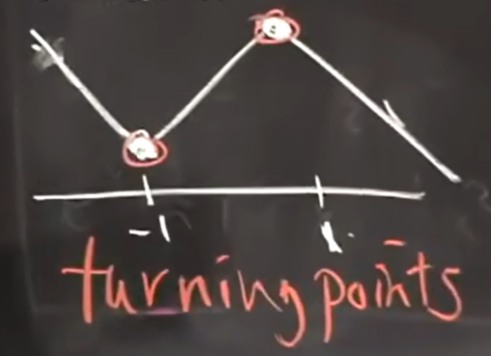
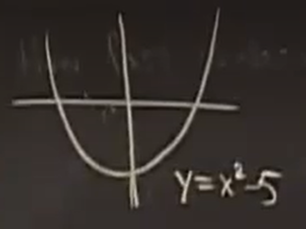
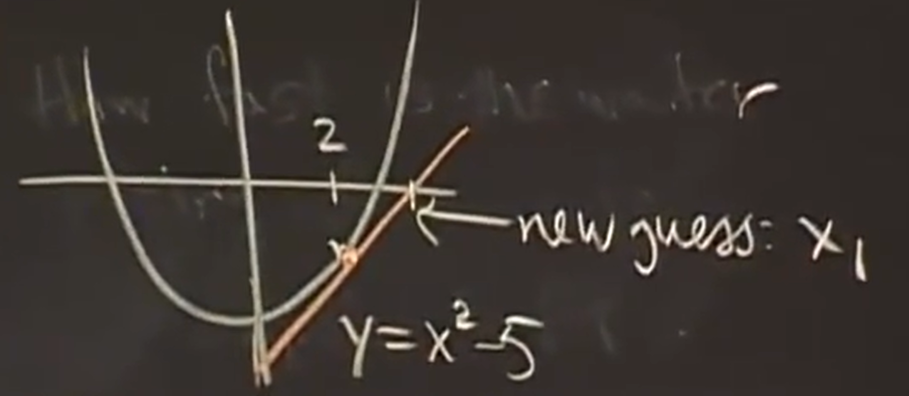

学习 [MIT-18.01](https://ocw.mit.edu/courses/18-01sc-single-variable-calculus-fall-2010/pages/syllabus/) 过程中做的笔记

## 极限与连续

左极限：$ \lim\limits_{ x \to x_0^-} f(x) $

右极限：$ \lim\limits_{ x \to x_0^+} f(x) $

（双侧）极限：$ \lim\limits_{ x \to x_0} f(x) $

> 比较反直觉的是，从表达式来看，某点处有极限并不要求函数在该点处有定义，换言之二者是不相关的

连续：$ \lim\limits_{ x \to x_0^-} f(x) = \lim\limits_{ x \to x_0^+} f(x) = \lim\limits_{ x \to x_0} f(x) = f(x_0) \iff \lim\limits_{x \to x_0} [f(x) - f(x_0)] = 0$

> 函数在某点连续要求函数在该点函数值等于（双侧）极限值，这隐含了两个前提：
> 1. 该点处的（双侧）极限应该是存在的
> 2. 该点处函数值应该是存在的

某点处极限不存在（即该点为间断点）的情况：

- 该点处的极限值存在（第一类间断点）
  - 可去间断点：$ \lim\limits_{ x \to x_0} f(x) = A $ 但 $ f(x_0) $ 不存在或 $ f(x_0) \ne A $
  - 跳跃间断点：$ \lim\limits_{ x \to x_0^-} f(x) = A $ 且 $ \lim\limits_{ x \to x_0^+} f(x) = B $ 但 $ A \ne B $
- 该点处的极限值不存在（第二类间断点）
  - 无穷间断点：$ \lim\limits_{ x \to x_0^-} f(x) = \pm \infty $ 或 $ \lim\limits_{ x \to x_0^+} f(x) = \pm \infty $
  - 震荡间断点：$ \lim\limits_{ x \to x_0} f(x) $ 不存在但也不是 $ \pm \infty $，只是在该点处不停震荡，例：$ \lim\limits_{x \to 0} \sin{\frac{1}{x}} $

两个重要极限：

$$
\begin{align*}
    & \lim\limits_{x \to 0} \frac{\sin x}{x} = 1 \\
    & \lim\limits_{x \to 0} \frac{1 - \cos x}{x} = 0
\end{align*}
$$

> 这两个极限需要用几何证明，当 $ \theta \to 0 $，曲线等同于直线，图示为  中对 $ \lim\limits_{x \to 0} \frac{\sin x}{x} = 1 $ 的几何证明，
> 
> 

## 导数

### 一阶导数

几何意义：割线斜率的极限/一点的切线

物理意义：物理量在某点的瞬时变化率

记号：$ f'(x) = \frac{\mathrm{d}f}{\mathrm{d}x} = \frac{\mathrm{d}}{\mathrm{d}x}f = \frac{\mathrm{d}y}{\mathrm{d}x} = \frac{\mathrm{d}}{\mathrm{d}x}y = Df = Dy$

表达式:

$$
\begin{align*}
    & f'(x) = \frac{ \Delta f}{\Delta x} = \lim\limits_{ \Delta x \to 0} \frac{ f(x + \Delta x) - f(x)}{\Delta x} \\
    & f'(x_0) = \frac{ \Delta f}{\Delta x} = \lim\limits_{ x \to x_0 } \frac{ f(x) - f(x_0) }{ x - x_0 } 
\end{align*}
$$

定理：函数在某点处可导，则函数在该点处必然连续（推广可知，处处可导的函数，处处连续）
证明：

$$
\begin{align*}
    \lim\limits_{x \to x_0} [f(x) - f(x_0)]
    & = \lim\limits_{x \to x_0} \frac{f(x) - f(x_0)}{x - x_0}(x - x_0) \\
    & = f'(x_0) \lim\limits_{x \to x_0} (x - x_0) \\
    & = f'(x_0) \times 0 \\
    & = 0
\end{align*}
$$

用表达式可以推出以下常见函数的导数：

$$
\begin{align*}
    & (x^r)' = rx^{r-1} \\
    & (\sin x)' = \cos x \\
    & (\cos x)' = - \sin x \\
    & (\tan x)' = \sec^2 x \\
    & (\sec x)' = \sec x \tan x \\
    & (a^x)' = a^x\ln a \\
    & (e^x)' = e^x \\
    & (\ln x)' = \frac{1}{x} \\
    & (\arctan x)' = \frac{1}{1 + x^2} \\
    & (\arcsin x)' = \frac{1}{\sqrt{1 - x^2}}
\end{align*}
$$

> 三角函数的导数推导过程中需要用到三角形和差角公式
> 
> $$
> \begin{align*}
>    & \sin(\alpha \pm \beta) = \sin\alpha \cos\beta \pm \cos\alpha \sin\beta \\
>    & \cos(\alpha \pm \beta) = \cos\alpha \cos\beta \mp \sin\alpha \sin\beta
> \end{align*}
> $$

导数四则运算公式：

$$
\begin{align*}
    & [f(x) \pm g(x)]' = f'(x) \pm g'(x) \\
    & [f(x)g(x)]' = f'(x)g(x) + f(x)g'(x) \\
    & [\frac{f(x)}{g(x)}]' = \frac{f'(x)g(x) - f(x)g'(x)}{g^2(x)}
\end{align*}
$$

求导链式法则：$ [f(g(x))]' = f'(g(x))g'(x) $

> 链式法则的原理是这样：$ \frac{\mathrm{d}f}{\mathrm{d}x} = \frac{\mathrm{d}f}{\mathrm{d}t} \frac{\mathrm{d}t}{\mathrm{d}x} $，其中 $ t = g(x) $

根据常见函数的导数、导数四则运算公式和求导链式法则，可以求出绝大部分函数的导数

### 高阶导数

含义：即导数的导数

记号：$ f^{(2)}(x) = \frac{\mathrm{d}\frac{\mathrm{d}f}{\mathrm{d}x}}{\mathrm{d}x} = \frac{\mathrm{d}}{\mathrm{d}x}\frac{\mathrm{d}f}{\mathrm{d}x} = \frac{\mathrm{d}}{\mathrm{d}x}\frac{\mathrm{d}}{\mathrm{d}x}f = (\frac{\mathrm{d}}{\mathrm{d}x})^2f = \frac{\mathrm{d}^2}{(\mathrm{d}x)^2}f = \frac{\mathrm{d}^2f}{\mathrm{d}x^2} = D^2f$

### 隐函数求导

#### 隐函数

含义：常见的形如 $ f(x) = \sin x $ 这样，能直接用含有自变量的算式表示的函数为显函数，而隐函数是形如 $ f(x, y) = 0 $ 这样的函数，比如 $ x^2 + y^2 = 1 $（单位圆的隐函数）

#### 求导

可以利用链式法则对隐函数求导，对于那些不好确定显函数的方程，隐函数求导往往是效果很好，比如对单位圆的隐函数求 $ y'$：

$$
\begin{align*}
    \frac{\mathrm{d}(x^2 + y^2)}{\mathrm{d}x} &= \frac{\mathrm{d}1}{\mathrm{d}x} \\
    \frac{\mathrm{d}x^2}{\mathrm{d}x} + \frac{\mathrm{d}y^2}{\mathrm{d}x} &= 0 \\
    2x + \frac{\mathrm{d}y^2}{\mathrm{d}y}\frac{\mathrm{d}y}{\mathrm{d}x} &= 0 \\
    2yy' &= -2x \\
    y' &= \frac{-x}{y} \\
    y' &= \frac{\mp x}{\sqrt{1 - x^2}}
\end{align*}
$$

### 反函数求导

#### 反函数

含义：如果 $ f(g(x)) = 1 $，则 $ f(x) $ 和 $ g(x) $ 互为对方的反函数

几何意义：图像关于 $ y=x $ 轴对称

记号：$ f^{-1}(x) $

#### 求导

通过原函数的导数，我们可以求出其反函数（如果有的话）的导数

> 不是所有函数都有反函数的，只有那些自变量和因变量能够一一对应的函数才会有反函数，这其实不难理解，对于 $ y(x) $，如果一个 $ x $ 可以对应多个 $ y $，那反过来，哪个 $ y $ 对应这个 $ x $ 呢？这个我们是无法确定的，所以这样的函数没有反函数

比如求 $ (\tan^{-1}x)' $（其实就是 $ \arctan' x $）：

$$
\begin{align}
    y &= \tan^{-1}x \\
    \tan y &= x \\
    (\sec^2 y)y'  &= 1 \\
    y'  &= \cos^2 y \\
    y'  &= \frac{1}{1 + x^2}
\end{align}
$$

$ (4) \implies (5) $ 需要用点技巧，我们可以通过 $ (2) $ 作出下图：

在图中用邻边比斜边可以得出 $ \cos y = \frac{1}{\sqrt{1 + x^2}} $

### 指数函数求导

#### 指数函数

含义：底数不变，指数改变的函数，比如 $ a^x(a \ne 0) $

#### 求导

公式：$ (a^x)' = a^x\ln a $

这个公式的证明不是很好理解，以下是过程，但是建议结合视频理解：

对于 $ f(x) = a^x $，根据定义

$$
\begin{align}
    f'(x) &= \lim\limits_{ \Delta x \to 0} \frac{ f(x + \Delta x) - f(x)}{\Delta x} \\
    &= \lim\limits_{ \Delta x \to 0} \frac{ a^{x + \Delta x} - a^x}{\Delta x} \\
    &= a^x\lim\limits_{ \Delta x \to 0} \frac{ a^{\Delta x} - 1}{\Delta x} \\
    &= a^x\lim\limits_{ \Delta x \to 0} \frac{ a^{0 + \Delta x} - a^0}{\Delta x} \\
    &= a^xf'(0)
\end{align}
$$

> 对于 $ (8) $ 这种差商形式，我们应该总是想到导数的定义

现在只需要知道 $ f'(0) $ 的值即可

为了知道 $ f'(0) $ 的值，我们需要另外一个假设：假设存在一个数 $ e $，使 $ g'(x) = (e^x)'\big\vert_{x = 0} = 1 $

但这里不能随意假设，假设之前我们需要证明 $ e $ 确实存在：

$$
\begin{align*}
    f(x) &= a^x \\
    f(kx) &= a^{kx} = (a^k)^x \xlongequal{令 b = a^x} b^x\\
    (b^x)' &= [f(kx)]' = kf'(kx) \\
    (b^x)' \big\vert_{x=0} &= kf'(0)
\end{align*}
$$

当 $ k = \frac{1}{f'(0)} $ 时，$ (b^x)'\big\vert_{x=0} = kf'(0) = 1 $，此时 $ b = e $，也就是 e 确实存在，假设成立

上面这部分证明过程从几何角度讲，也就是说对于任意的 $ f(x) = a^x $，我们把它横向拉伸或压缩 $ \frac{1}{f'(0)} $ 倍后，总能得到 $ g(x) = e^x $

到这里其实我们可以推得一个常用公式：$ g'(x) = (e^x)' = e^xg'(0) = e^x $

利用这个公式，我们就可以得到

$$
\begin{align*}
    f'(x) &= (a^x)' = (e^{x\ln a})' = e^{x\ln a}\ln a = a^x\ln a \\
    f'(0) &= a^0\ln a = \ln a
\end{align*}
$$

从这个推导过程我们可以得到一个经验，对于任意指数函数，我们总是可以做形如 $ a^x = e^{x\ln a} $ 的变换后，利用链式法则求导

### 对数函数求导

含义：形如 $ \ln x $ 的函数，这个函数的底数为 $ e $，我们总是讨论这种情况，其余底数的情况一般不做讨论

公式：$ (\ln x)' = -\frac{1}{x} $

推导过程利用到了刚刚得到的公式 $ (e^x)' = e^x $，如下

假设 $ w = \ln x $，则 $ e^w = x $，故

$$
\begin{align*}
    (e^w)' &= e^ww'=1 \\
    w' &= \frac{1}{e^w} = \frac{1}{e^{\ln x}} = \frac{1}{x}
\end{align*}
$$

同样，从这个推导过程我们可以得到另一个经验，对于任意对数函数，我们总是可以假设 $ w = \ln x $，令 $ e^w = x $ 后求导

### $ e $ 的近似估算

利用 $ \lim\limits_{n \to \infty}(1 + \frac{1}{n})^n $，我们可以这么算

$$
\begin{align*}
    \lim\limits_{n \to \infty}(1 + \frac{1}{n})^n &= \lim\limits_{n \to \infty}e^{n\ln (1 + \frac{1}{n})} \\
    &= e^{\lim\limits_{n \to \infty}{n\ln (1 + \frac{1}{n})}} \\
    &= e^{\lim\limits_{n \to \infty}\frac{\ln (1 + \frac{1}{n})}{\frac{1}{n}}} \\
    &= e^{\lim\limits_{n \to \infty}\frac{\ln (1 + \frac{1}{n}) - \ln 1}{\frac{1}{n}}} \\
    &= e^{\ln'(1+x)\big\vert_{x = 0}} \\
    &= e^{\frac{1}{1 + x}\big\vert_{x = 0}} \\
    &= e \\
\end{align*}
$$

也就是说我们可以取较大的 $ n $，代入 $ (1 + \frac{1}{n})^n $ 求得 $ e $ 的近似值

## 导数的应用

### 线性近似

第一种表达式：当 $ x \to x_0$ 时，$ f(x) \approx f(x_0) + f'(x_0)(x - x_0) $

第二种表达式：当 $ \Delta x \to 0$ 时，$  \frac{f(x_0 + \Delta x)}{\Delta x} = \frac{\Delta y}{\Delta x} \approx f'(x_0) $

几何意义：$ f(x) $ 在 $ x_0 $ 处的切线

物理意义：当 $ \Delta x \to 0$ 时，$ f(x) $ 的平均变化率约等于瞬时变化率

例如：对于 $ f(x) = \ln x $，其在 $ x = 1 $ 附近近似于 $ f(1) + f'(1)(x - 1) = 0 + 1 \times (x - 1) = x - 1 $，从几何意义上讲，就是说 $ \ln x $ 在 $ x = 1 $ 处的切线为 $ y = x - 1 $

> 其实就是导数定义表达式做了移项变换那些，表现出不同的形式，也有了不同的意义

可以根据这个来估算一些值，比如 $ \ln (1 + x) $ 在 $ x \to 0 $ 时，近似于 $ x $，所以 $ \ln 1.1 = \ln (1 + 0.1) \approx 0.1 $

一般用到这个技巧的时候都是式子本身比较难算，但近似后很好算的时候，比如求 $ f(x) = \frac{e^{-3x}}{\sqrt{1+x}} $ 的线性近似

$$
\begin{align*}
    f(x) &= \frac{e^{-3x}}{\sqrt{1+x}} \\
    &\approx e^{-3x}(1+x)^{\frac{-1}{2}} \\
    &= (1 - 3x)(1 - \frac{1}{2}x) \\
    &= 1 - 3x - \frac{1}{2}x + \frac{3}{2}x^2 \\
    &= 1 - \frac{7}{2}x
\end{align*}
$$

> 在线性近似中，比 $ x $ 高次的项可以舍去，比如上面的 $ \frac{3}{2}x^2 $

其实，我们可以把这个近似广义化，比如对 $ T_1 = \frac{T_0}{\sqrt{1 - \frac{v^2}{c^2}}} $，当 $ \frac{v^2}{c^2} \to 0 $ 时，$ T_1 \approx T(1 + \frac{v^2}{2c^2}) $

> 在这个例子里面，我们把 $ \frac{v^2}{c^2} $ 当作一个整体看待

### 二阶近似

表达式：当 $ x \to x_0$ 时，$ f(x) \approx f(x_0) + f'(x_0)(x - x_0) + \frac{f^{(2)}(x)}{2}(x- x_0)^2 $

> 对于 $ \frac{1}{2} $ 从何而来，可以把 $ f(x) = ax^2 + bx + c $ 在 $ x = 0 $ 附近的二阶近似写出来验证，即 $ f(x) \approx f(0) + f'(0)(x - 0) + \frac{f^{(2)}(0)}{2}(x - 0)^2 = c + bx + \frac{1}{2} \times 2ax^2 = ax^2 + bx + c $

几何意义：最逼近 $ f(x) $ 在 $ x_0 $ 处的抛物线

> 其实就是线性近似的基础上再进行修正，使得近似结果更加精确，我们只在线性近似精度不够，无法解决问题的时候才会用二阶近似

例如：$ \ln (1 + x) $ 在 $ x \to 0 $ 时，二阶近似于 $ x - \frac{x^2}{2} $，所以 $ \ln 1.1 = \ln (1 + 0.1) \approx 0.1 + 0.5 \times 0.01 = 0.095 $，这个结果比线性近似得到的 $ 0.1 $ 更加精确

常见的二阶近似（$ x = 0 $ 处成立）

$$
\begin{align*}
    &\sin x \approx x \\
    &\cos x \approx 1 - \frac{1}{2}x^2 \\
    &e^x \approx 1 + x + \frac{1}{2}x^2 \\
    &\ln(1 + x) \approx x - \frac{1}{2}x^2 \\
    &(1 + x)^r \approx 1 + rx + \frac{r(r-1)}{2}x^2 \\
\end{align*}
$$

### 曲线构图

知道 $ f'(x) $ 和 $ f^{(2)}(x) $ 即可

$ f'(x) > 0 (<0) $ 时，$ f(x) $ 单调递增（递减），函数在坐标系是上升（下降）的

$ f^{(2)}(x) > 0 (<0) $ 时，$ f'(x) $ 单调递增（递减），函数在坐标系是凹（凸）的

$ f'(x) $ 符号发生变化的点，即图中 $ x = -1 $ 和 $ x = 1 $ 这两个点叫做极值点（Turning Point），$ f(-1) $ 和 $ f(1) $ 为极值（Turning Value）

$ f'(x_0) = 0 $ 时，$ x_0 $ 为函数的驻点（Critical Point），$ f(x_0) $ 为驻点值（Critical Value）

> （如果 $ f'(x) $ 连续，或者说图像是光滑的，没有折角，折点不存在导数）极值点一定是驻点，驻点不一定就是极值点，比如 $ x^3 $ 在 $ x = 0 $ 处，$ f'(0) = 0 $，但该点两侧 $ f'(x) $ 符号没有发生改变，即 $ x = 0 $ 是驻点，但不是极值点

$ f^{(2)}(x_0) $ 的符号发生变化的点，即 $ (x_0, f(x_0)) $，被称为拐点（Inflection Point）

> 极值点和拐点的一个细节上的不同在于，极值点是一个一维点，而拐点是一个二维点
> 另外，和极值点、驻点类似的是，当 $ f^{(2)}(x) = 0 $ 时，$ (x_0, f(x_0)) $ 不一定就是拐点，因为这个点两侧的 $ f^{(2)}(x) $ 的符号可能并不会发生改变，比如 $ x^4 $

曲线构图的一般步骤：

1. 描点
   1. 间断点（尤其是无穷间断点）
   2. 无穷点（$ x \to \pm \infty $）
   3. 简单点（可选）
2. 求解 $ f'(x) = 0 $，得到并描出驻点
3. 确定 $ f'(x) $ 在驻点和间断点之间的正负（用作对前面两步的二次检查）
4. 确定 $ f^{(2)} $ 的正负，得到拐点和曲线的凹凸性
5. 组合所有信息，画出图像

### 求最值

只需要考察函数在端点（End Point）、驻点（Critical Ponint）和间断点（Discontinuity Point）处的函数值，然后对比即可

## 相关变化率

即给定一个一阶导数的值，需要求另一个一阶导数值的问题

比如：给定一个底部半径为 $4 m$，高为 $10 m$ 的圆锥形容器，注水速度 $S_V$ 为 $2 m³/min$，当水面高度为 $5 m$ 时，水面上升速度 $S_h$ 为多少

对于这种问题，我们总是可以把给出的和要求的两个一阶导 “积分还原”，然后写出还原后的两个变量之间的关系，对该关系式进行隐函数求导，然后解出所求的值

比如：对于上述问题，我们令圆锥的体积为 $V$

题目中给出的一阶导为 $S_V = \frac{\mathrm{d}V}{\mathrm{d}t}$，需要求的是 $ S_h = \frac{\mathrm{d}h}{\mathrm{d}t}$

我们可以先将二者积分还原为 $V$ 和 $h$，然后写出两个之间的关系 $V = \frac{1}{3}\pi r^2h=\frac{1}{3}\pi (\frac{2}{5}h)^2h=\frac{4}{75}\pi h^3$

对关系式隐函数求导得 $\frac{\mathrm{d}V}{\mathrm{d}t}=\frac{4}{25}\pi h^2\frac{\mathrm{d}h}{\mathrm{d}t}$，把题目给出的条件带入可得 $S_V=2=4\pi S_h$

解得 $S_h=\frac{1}{2\pi}$

## 牛顿迭代法

一个用于求平方根近似值的方法，具体步骤如下：

假设我们要求 $\sqrt{5}$，我们可以令 $ x=\sqrt{5} $，则 $x^2-5=0$，我们可以画出这个图像

现在我们可以估计一个比较接近的值，比如 $x=2$，因为它是 $\sqrt{4}$

然后取这点的线性近似线，其与 $x$ 轴的交点既是新的估计值，如此往复，即可找到一个足够接近结果的值

对于 $y=x^2-5$，我们可以知道它在 $(x_0,y_0)$ 的切线方程为 $y-y_0=m(x-x_0)$，其中 $m$ 为该点的斜率，即 $m=2x_0$，令 $y=0$，取截距可以得到新的估计值 $x_1=x_0-\frac{{x_0}^2-5}{2x_0}=\frac{1}{2}x_0+\frac{5}{2x_0}$

更通用地，我们可以知道 $x_{n+1}=x_n-\frac{f(x_n)}{f'(x_n)}$

现在我们的 $x_0=2$，则带入公式得 $x_1=\frac{161}{72}$

这里可以给出牛顿迭代法在正确工作下的精度

假设误差 $ E_n=|x-x_n| $，则 $ E_n={E^2_{n-1}} $

这里就体现出了牛顿迭代法的局限性，假设我们选取了一个误差超过 $1$ 的初始点，则牛顿迭代法永远都不会产生正确的结果

事实上，牛顿迭代法有以下局限性：

1. $|f'(x)|$ 不是很小且 $|f^{(2)}(x)|$ 不是很大
2. $x_0$ 足够接近目标值（误差不超过 $1$）